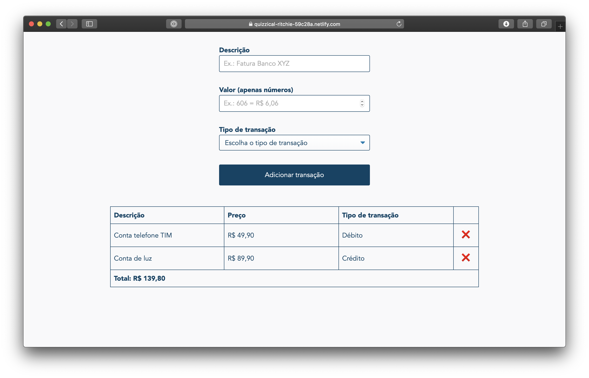

# Forgotten past

## Introduction

This is a small pet project to track down monthly transactions that I made bespoke for my parents.

## Requirements and how to run locally

To run this project locally, you need Node.js® v10+ and a Web Browser with localStorage support.

- Download or clone this repo `git clone git@github.com:AgtLucas/forgotten-past.git`
- Install project's dependencies via [`yarn`](https://yarnpkg.com) or [`npm`](https://npmjs.com)
- Run the project by typing `npm start` in your Terminal app of choice
- Open `http://localhost:3000` in your Web Browser and have fun!

## Tech stack

- Powered by [ReactJS](https://reactjs.org) 
- Scaffold using [Create React App](https://github.com/facebook/create-react-app)
- Styled using CSS and some [CSS Modules](https://github.com/css-modules/css-modules)
- Uses [Dinero.js](https://github.com/sarahdayan/dinero.js) to format currency
- Uses [Formik](https://github.com/jaredpalmer/formik) for a better form experience
- Uses localStorage to save your transactions
- [Jest](https://jestjs.io) and [Enzyme](https://airbnb.io/enzyme/) for basic UI tests

## Demo

Feel free to check the demo out [here](https://quizzical-ritchie-59c28a.netlify.com).

## LICENSE

<h6 align="center">
	<a href="LICENSE">MIT</a>
	©
	Lucas da Silva
</h6>
